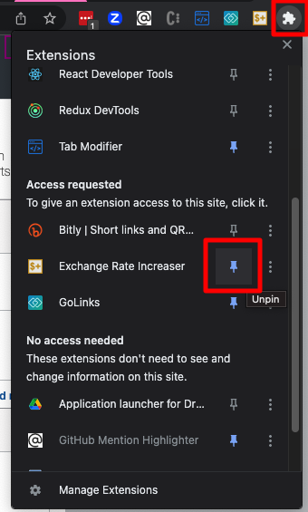

# Chrome-FX-plugin

This Chrome extension finds an input element named `exchangeRate` in the current web page, and then it increases its value by 5%. 

If you want to use a different % then edit `extensions/popup.js`.

## To use this Chrome extension

1. Open Google Chrome and go to `chrome://extensions/`.
1. Enable the "Developer mode" toggle in the top right corner.
1. Click on the "Load unpacked" button and select the `extension` folder from this repo.
1. The extension should now be installed and active. You will see a new button labeled "Increase Exchange Rate" in your browser's toolbar.
1. Open a webpage that contains an input element with the name "exchangeRate."
1. Click on the "Increase Exchange Rate" button in the toolbar, and the value of the input element will be increased by 5%.

If you use it frequently then pin it...

